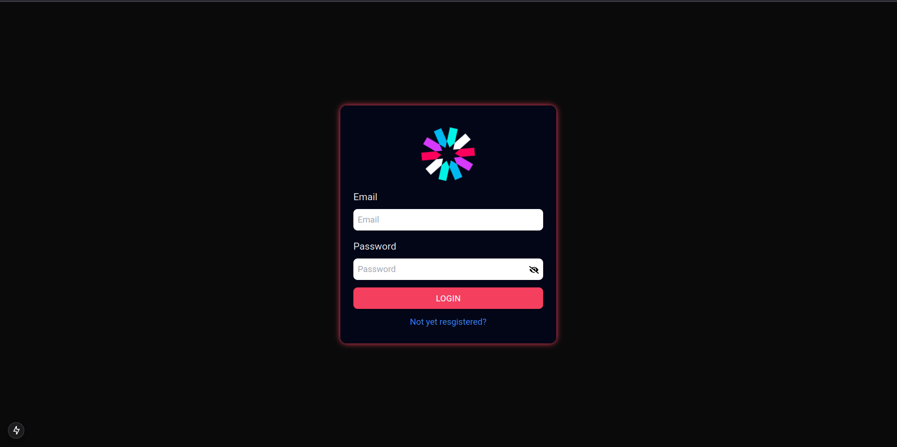
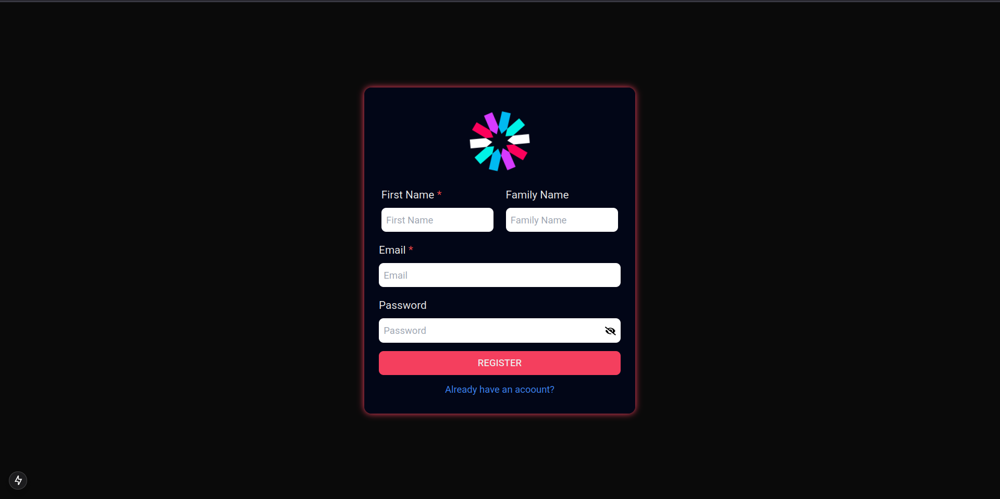
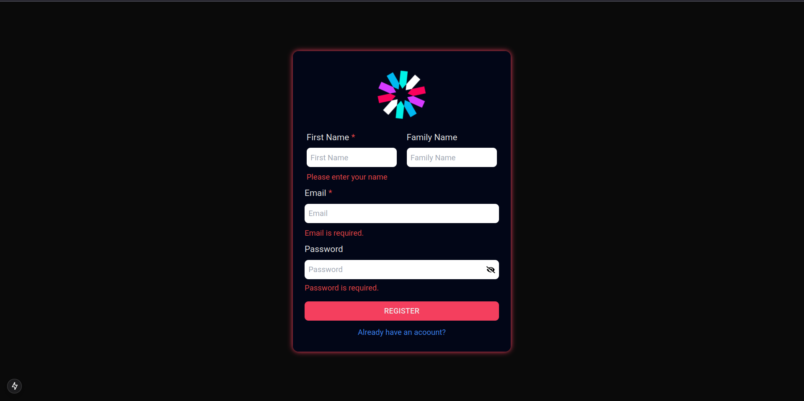

# 🔐 Login & Registration UI Starter

A **Next.js 15** and **Tailwind CSS** starter template for building secure applications.  
Includes ready-to-use **Login** and **Registration** screens that connect to your backend authentication service.

> ⚡ Designed to help you quickly bootstrap any project with authentication as the first step.

---

## ✨ Features

- **Login Screen** – Clean and responsive design for user authentication.
- **Registration Screen** – Simple form to create new user accounts.
- **Next.js 15 + Tailwind CSS** – Fast, modern, and fully customizable.
- **Validation using Zod** – Form Validations using Zod.
- **Backend Ready** – Communicates with your **Spring Boot** backend for authentication.
- **Starter Template** – Easily extendable for any secure app.

## 📸 Screenshots

**Login**


**Register**


**Validations**


---

## 🚀 Getting Started

First, install dependencies:

```bash
npm install
# or
yarn install
# or
pnpm install
# or
bun install
```

Run the development server:

```bash
npm run dev
# or
yarn dev
# or
pnpm dev
# or
bun dev
```

Open [http://localhost:3000](http://localhost:3000) in your browser to see it live.

---

## 📂 Project Structure

- `app/login/page.tsx` – Login page UI.
- `app/register/page.tsx` – Registration page UI.
- `components/` – Reusable form components and input fields.
- `styles/` – Tailwind styling.

---

## ⚙️ Backend Integration

This template is built to communicate with a **Spring Boot backend** that handles authentication logic.  
Update the API endpoint URLs inside the project to match your backend.

---

## 📚 Learn More

- [Next.js Documentation](https://nextjs.org/docs) – Learn about Next.js features and API.
- [Tailwind CSS Docs](https://tailwindcss.com/docs) – Explore styling utilities.

---

## ☁ Deployment

You can deploy easily on [Vercel](https://vercel.com/new?utm_medium=default-template&filter=next.js&utm_source=create-next-app).

For more options, see the [Next.js deployment docs](https://nextjs.org/docs/app/building-your-application/deploying).
